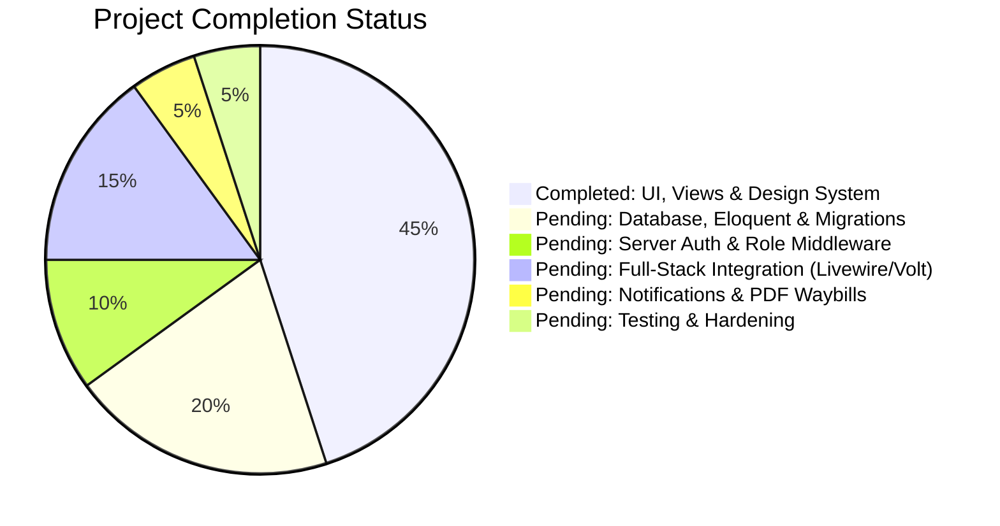

# Mount Zion Haulage & Logistics — Project Status & Master TODO

> **Current Architecture Assessment**:  
> The project currently features a **fully designed, polished, responsive frontend** (with dark mode, interactive widgets, and modals) powered by Tailwind CSS v4, Blade, and Livewire Flux. However, the data and auth layers are currently running on **mock client-side JavaScript (`localStorage` via `store.js`)**. The backend (database models, migrations, server-side authentication middleware, and real persistence) has not yet been built.

---

## 📊 Summary of Completed Work vs. Remaining Work

---

## ✅ Phase 1: Completed So Far (Frontend, UI & Interactive Prototypes)

### 1. Public Marketing Website
- [x] **Brand Design System**: Cohesive brand styling (Mount Zion red/dark navy theme), custom typography (`Poppins`), favicon set, touch icons, and web manifest.
- [x] **Dark / Light Mode**: Seamless theme toggling with zero-flash head script and `localStorage` persistence.
- [x] **Home Page (`/`)**: Hero banner, live tracking teaser form, quick quote trigger, core value propositions, service highlights, fleet statistics, customer testimonials, and dual-depot contact footers.
- [x] **About Page (`/about`)**: Corporate heritage, company background, fleet infrastructure, route coverage (Lagos to Port Harcourt corridor), and mission/values.
- [x] **Services Page (`/services`)**: Full cargo breakdown (Interstate Haulage, Freight Forwarding, Secure Warehousing, Express Door Delivery, Port Clearance & Heavy Lift).
- [x] **FAQ Page (`/faq`)**: Interactive accordion answers for shipping requirements, prohibited items, transit schedules, payment terms, and insurance coverage.
- [x] **Contact Page (`/contact`)**: Dual depot address display (Alaba Base Lagos & D-Line Port Harcourt), interactive Google Map switcher tab, direct dispatch phone lines, and interactive inquiry form.
- [x] **Interactive Waybill Quote Calculator (`/quote`)**: Multi-step wizard (Cargo Category, Quantity/Volume, Route Selection, Sender/Consignee Info, instant fee range calculation algorithm).
- [x] **Public Tracking Portal (`/track`)**: Consignment waybill tracker with sample tracking IDs (`MZ-2026-881`, `MZ-2026-104`, `MZ-2026-552`), route progress visualizer, and timestamped milestone checkpoints.
- [x] **Custom Error Pages**: Branded `403 Forbidden`, `404 Not Found`, `500 Server Error`, and `503 Maintenance` pages.

### 2. Staff Admin Portal (`/admin`)
- [x] **Admin Layout & Navigation**: Responsive sidebar with mobile drawer, notifications indicator, theme toggle, and logged-in staff badge.
- [x] **Admin Login Screen (`/admin/login`)**: Work email and phone number login UI with preset demo staff accounts.
- [x] **Dashboard (`/admin`)**: Metric cards for active waybills, pending quotes, in-transit manifests, unread inquiries, and daily dispatch progress.
- [x] **Daily Manifests (`/admin/manifests`)**: UI to view daily loading sheets, add consignments, assign driver/truck, update manifest status (Loading, In Transit, Arrived).
- [x] **Quotes Management (`/admin/quotes`)**: Inbound quote requests table, customer contact information, fee override options, and accept/reject actions.
- [x] **Customer Inquiries (`/admin/messages`)**: Inbox for public contact submissions with read/unread statuses.

### 3. Super Admin Executive Portal (`/super-admin`)
- [x] **Executive Layout & Navigation**: Executive dashboard layout with quick switcher between depots, export triggers, and audit status.
- [x] **Super Admin Login (`/super-admin/login`)**: Executive sign-in screen.
- [x] **Executive Analytics (`/super-admin`)**: Revenue summaries, route profitability indicators, depot throughput comparisons, and truck utilization charts.
- [x] **Cross-Depot Manifest Oversight (`/super-admin/manifests`)**: System-wide manifest monitor with search, status filtering, and override controls.
- [x] **Finance & Accounting (`/super-admin/finance`)**: Financial statements, revenue breakdowns, operational expenses (fuel, vehicle maintenance, driver trip allowances), and net profit calculations.
- [x] **Fleet & Drivers (`/super-admin/drivers`)**: Registry of drivers (Lagos & PHC depots), truck license plates, vehicle specs, license expiration warnings, and contact info.
- [x] **Staff Management (`/super-admin/staff`)**: Staff user directory, depot assignment (PHC vs Lagos), and role allocation.
- [x] **System Settings (`/super-admin/settings`)**: Base pricing per kg/carton configuration, depot operating addresses, notification toggles.
- [x] **Audit Trail (`/super-admin/audit`)**: Security and activity event logger.

---

## 🔲 Phase 2: What Needs to Be Done to Finish the Project

Below is the concrete roadmap organized by priority and architectural layer.

### Priority 1: Backend Foundation (Database Schema & Eloquent Models)
Replace mock JSON in `public/js/store.js` with structured relational database tables.

- [ ] **1.1 Database Migrations**:
  - `depots`: Store physical hubs (`name`, `code` [LAG/PHC], `address`, `phone`, `email`, `is_active`).
  - `roles_and_permissions`: Define user roles (`customer`, `staff_admin`, `super_admin`) or use role column on `users`.
  - `pricing_rates`: Dynamic freight pricing matrix (`cargo_type`, `unit_type` [kg/carton/pallet], `base_fee`, `per_unit_fee`, `insurance_rate`).
  - `drivers`: Driver records (`first_name`, `last_name`, `phone`, `license_number`, `license_expiry`, `depot_id`, `status` [active/on_trip/suspended]).
  - `vehicles`: Fleet trucks (`plate_number`, `model`, `capacity_tons`, `depot_id`, `status` [available/maintenance/in_transit]).
  - `manifests`: Dispatch trip records (`manifest_number`, `origin_depot_id`, `destination_depot_id`, `driver_id`, `vehicle_id`, `departure_time`, `arrival_time`, `status` [draft/loading/in_transit/arrived/unloaded]).
  - `shipments` / `waybills`: Individual consignments (`waybill_number` [e.g. MZ-2026-XXXX], `manifest_id`, `sender_name`, `sender_phone`, `sender_address`, `receiver_name`, `receiver_phone`, `receiver_address`, `origin_depot_id`, `destination_depot_id`, `cargo_description`, `quantity`, `weight_kg`, `freight_fee`, `payment_status` [pending/paid], `delivery_status` [received/manifested/in_transit/arrived/delivered]).
  - `shipment_checkpoints`: Tracking timeline events (`shipment_id`, `status_code`, `location`, `description`, `created_at`, `created_by`).
  - `quotes`: Inbound online quote requests (`quote_reference`, `customer_name`, `phone`, `email`, `cargo_type`, `quantity`, `description`, `origin`, `destination`, `estimated_min_price`, `estimated_max_price`, `final_quoted_price`, `status` [pending/approved/declined/converted]).
  - `contact_messages`: Public inquiries (`name`, `email`, `phone`, `subject`, `message`, `status` [unread/read/replied]).
  - `expenses`: Operational expenses (`category` [fuel/maintenance/allowance], `amount`, `depot_id`, `manifest_id`, `date`, `receipt_ref`, `logged_by`).
  - `audit_logs`: Operational & security audit records (`user_id`, `action`, `entity_type`, `entity_id`, `ip_address`, `details`).

- [ ] **1.2 Eloquent Models & Relationships**:
  - Implement Models (`Depot`, `Driver`, `Vehicle`, `Manifest`, `Shipment`, `ShipmentCheckpoint`, `Quote`, `ContactMessage`, `Expense`, `AuditLog`).
  - Configure relationships: `Manifest belongsTo Driver`, `Manifest hasMany Shipments`, `Shipment hasMany Checkpoints`, etc.
  - Implement database factories and comprehensive seeders to populate initial depots, test drivers, staff, and sample waybills.

---

### Priority 2: Real Server-Side Authentication & Authorization
Replace the client-side `localStorage` guards (`auth.js`) with robust Laravel security.

- [ ] **2.1 Role-Based Authentication Guards**:
  - Add `role` column to `users` table (`customer`, `staff`, `super_admin`) or setup dedicated guards.
  - Implement custom middleware in `bootstrap/app.php`:
    - `EnsureUserIsStaffAdmin`: Restricts `/admin/*` routes to authenticated users with `staff` or `super_admin` role.
    - `EnsureUserIsSuperAdmin`: Restricts `/super-admin/*` to `super_admin` only.
  - Apply middleware to route groups in `routes/web.php`.
- [ ] **2.2 Real Login Endpoints & Session Management**:
  - Replace the JavaScript form submission in `/admin/login` and `/super-admin/login` with real Laravel Auth controllers or Livewire Volt auth actions (`Auth::attempt`).
  - Proper session expiration, CSRF token validation, and rate limiting (prevent brute force on login).
  - Secure logout action (`POST /admin/logout`, `POST /super-admin/logout`).

---

### Priority 3: Full-Stack Feature Wiring (Livewire / Volt)
Replace JavaScript storage calls with Livewire Volt components or Controller endpoints.

- [ ] **3.1 Public Quote Submission**:
  - Convert `pages/quote.blade.php` to save to the database.
  - Calculate real estimates using server-side `pricing_rates`.
  - Return real quote reference number (e.g. `MZ-Q7821`) saved in DB.
- [ ] **3.2 Public Real-Time Tracking**:
  - Wire `pages/track.blade.php` to fetch live status and checkpoint history from `Shipment` and `ShipmentCheckpoint` models.
  - Return proper "Waybill Not Found" status if an invalid tracking ID is provided.
- [ ] **3.3 Public Contact Us Form**:
  - Wire `pages/contact.blade.php` to validate and store inquiries in `contact_messages` table.
- [ ] **3.4 Staff Admin Operations**:
  - **Manifest Builder**: Real-time assignment of waybills to manifests, driver selection, truck assignment, and one-click dispatch status change (`In Transit`).
  - **Quote Processing**: Enable staff to review pending quotes, input official negotiated pricing, and convert an approved quote into an active shipment waybill.
  - **Status Updates**: Allow depot staff at destination (Port Harcourt) to mark manifests as `Arrived` and waybills as `Ready for Pickup` or `Delivered`.
  - **Messages Inbox**: View, filter, and mark inquiries as handled.
- [ ] **3.5 Super Admin Executive Control**:
  - **Financial Reconciliations**: Aggregate live revenue from shipments minus fuel/maintenance expenses to show real-time profit and loss.
  - **Driver & Fleet Management**: Full CRUD for drivers and trucks, with automated alerts for expired driving licenses or maintenance due dates.
  - **Staff User Management**: Create new depot officers, assign depot locations, reset passwords, and toggle active status.
  - **Dynamic Pricing Controls**: Allow super admin to update freight rates per kg / carton without editing code.

---

### Priority 4: Logistics Documents & Waybill Printing
- [ ] **4.1 Printable Official Waybill Receipt**:
  - Implement a printable / PDF Waybill (using `barryvdh/laravel-dompdf` or clean printable Blade template).
  - Include waybill barcode / QR code, sender & receiver info, cargo details, depot stamps, terms & conditions, and signature lines.
- [ ] **4.2 Manifest Loading Sheet Export**:
  - Printable manifest sheet for truck drivers with the itemized cargo list, receiver phone numbers, and destination delivery addresses.

---

### Priority 5: Automated Notifications (Email & SMS)
- [ ] **5.1 Customer Notifications**:
  - Quote acknowledgment email with estimated pricing.
  - Shipment confirmation email / SMS with waybill tracking link upon depot drop-off.
  - Arrival notification (SMS / WhatsApp) to consignee when the truck reaches Port Harcourt D-Line depot.
- [ ] **5.2 Internal Staff Alerts**:
  - Email notification to depot managers when a new online quote or urgent contact message is submitted.

---

### Priority 6: Automated Testing, Security & Hardening
- [ ] **6.1 Pest Feature Tests**:
  - Tests for public quote generation and database persistence.
  - Tests for waybill tracking with valid and non-existent tracking numbers.
  - Authorization tests: Verify guests cannot access `/admin` or `/super-admin` (assert HTTP 302 / 403).
  - Authorization tests: Verify staff users cannot access `/super-admin` finance and settings.
  - Tests for manifest state transitions (`loading` -> `in_transit` -> `arrived`).
- [ ] **6.2 Security & Rate Limiting**:
  - Apply `throttle:10,1` to tracking lookups and quote requests to prevent scraping and abuse.
  - Input sanitization and phone number normalization.

---

### Priority 7: Production Deployment & Maintenance
- [ ] Set up production database (MySQL or PostgreSQL).
- [ ] Run `npm run build` and ensure all Vite assets compile cleanly.
- [ ] Configure Laravel queue worker (`php artisan queue:work`) for background emails and notifications.
- [ ] Set up cron scheduler (`php artisan schedule:run`) for daily manifest summaries and system maintenance.

